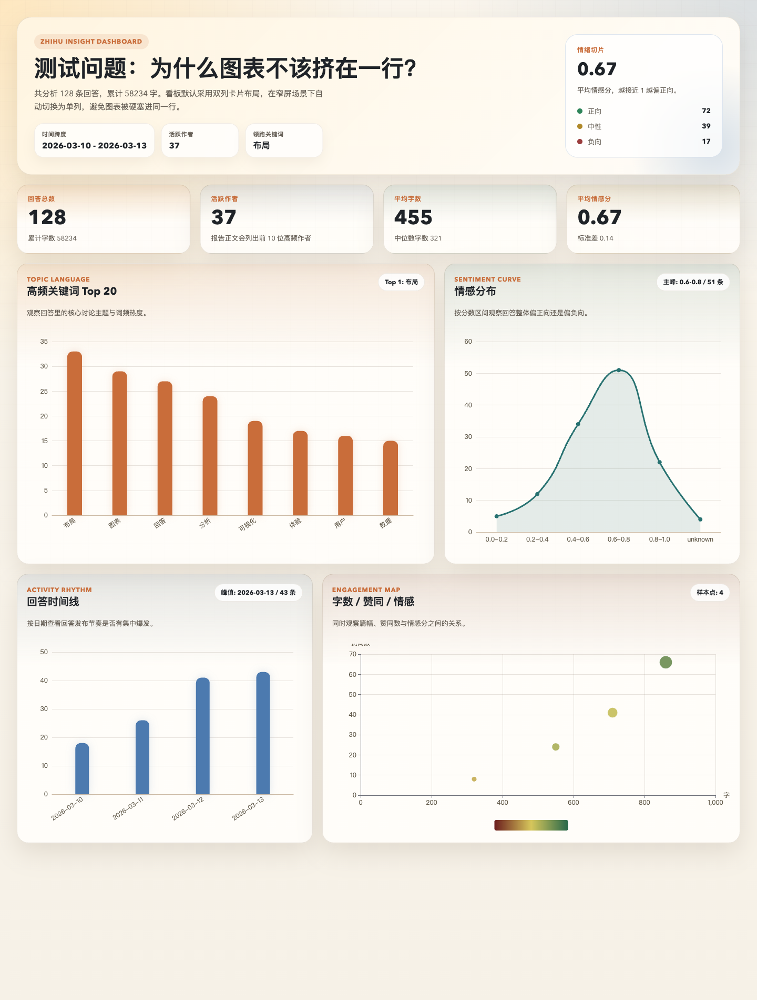

# Zhihu Answer Analysis Report Skill

A standalone repository for crawling Zhihu question answers and turning them into a Markdown analysis report with:

- `jieba` keyword segmentation
- word cloud generation
- `SnowNLP` sentiment analysis
- LDA topic clustering
- inferred author network graph
- ECharts visualizations embedded directly in `report.md`

This repo can be used in two ways:

1. As a standalone local analysis tool
2. As a Codex skill repository

## Features

- Crawl all visible answers under a Zhihu question
- Accept a Zhihu answer URL and automatically expand to the parent question
- Re-analyze an existing local Markdown export without crawling again
- Generate:
  - `report.md`
  - `analysis/summary.json`
  - `analysis/answers.jsonl`
  - `analysis/dashboard.html`
  - `analysis/wordcloud.png`
  - `raw/entries/*/index.md`
  - `raw/zhihu.db`

## Preview

Sample dashboard render generated from the bundled report script:



## Requirements

- Python 3.10+
- A valid Zhihu login cookie for live crawling

## Installation

```bash
git clone https://github.com/Smartloe/zhihu-answer-analysis-report-skill.git
cd zhihu-answer-analysis-report-skill
python3 -m pip install -e .
```

## Cookie Setup

For live Zhihu crawling, copy the template and fill in real cookie values:

```bash
cp cookies.example.json cookies.json
```

At minimum, provide real `z_c0` and `d_c0` values.

You can also place multiple accounts under `cookie_pool/` if you want rotation.

## Usage

Analyze a Zhihu question:

```bash
python3 scripts/zhihu_answer_report.py \
  "https://www.zhihu.com/question/2010761296434458950"
```

Analyze an answer URL by expanding to the full question:

```bash
python3 scripts/zhihu_answer_report.py \
  "https://www.zhihu.com/question/2010761296434458950/answer/2014338133962027157"
```

Analyze an existing local directory without crawling again:

```bash
python3 scripts/zhihu_answer_report.py ./data/entries
```

Fast smoke test:

```bash
python3 scripts/zhihu_answer_report.py \
  "https://www.zhihu.com/question/2010761296434458950" \
  --answer-cap 30 \
  --no-images
```

## Useful Flags

- `--answer-cap N`: cap the number of answers
- `--output-dir PATH`: write outputs to a custom directory
- `--no-images`: skip image downloads
- `--stopwords FILE`: extend the bundled stopword list
- `--font-path FILE`: override the word cloud font
- `--top-k N`: control the top keyword count
- `--lda-topics N`: number of LDA topics (set to 0 to disable)
- `--lda-words N`: top words per LDA topic
- `--lda-max-iter N`: LDA training iterations
- `--network-max-nodes N`: cap author nodes in the inferred author network (`0` disables it)
- `--network-max-edges N`: cap author links in the inferred author network

## Output Layout

```text
output-dir/
├── report.md
├── analysis/
│   ├── answers.jsonl
│   ├── corpus.txt
│   ├── dashboard.html
│   ├── summary.json
│   └── wordcloud.png
└── raw/
    ├── entries/
    └── zhihu.db
```

## Codex Skill Usage

The Codex skill definition is in [SKILL.md](./SKILL.md).

To install it manually into Codex:

```bash
cp -R . ~/.codex/skills/zhihu-answer-analysis-report
```

After that, restart Codex and trigger it with prompts like:

```text
使用 zhihu-answer-analysis-report 技能分析这个知乎问题，并输出完整 Markdown 报告
```

## Notes

- Zhihu may report a higher answer total than the number of answers actually returned by paginated APIs.
- The report embeds the ECharts dashboard via `iframe`, so the Markdown renderer must support inline HTML for the chart area to appear directly in the document.
- The author network is an inferred similarity graph based on topic and keyword overlap, not Zhihu's real follow/comment relationship graph.
- `cookies.json`, `cookie_pool/`, `data/`, logs, and SQLite files are ignored by Git.

## License

MIT
